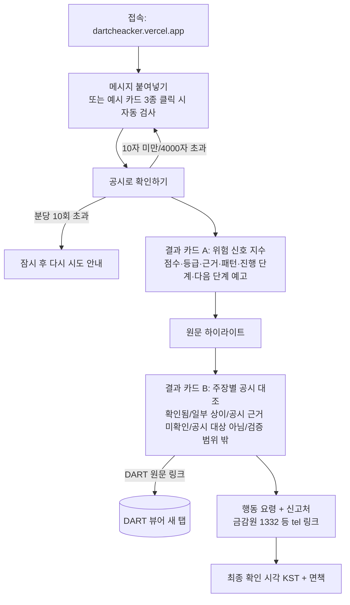
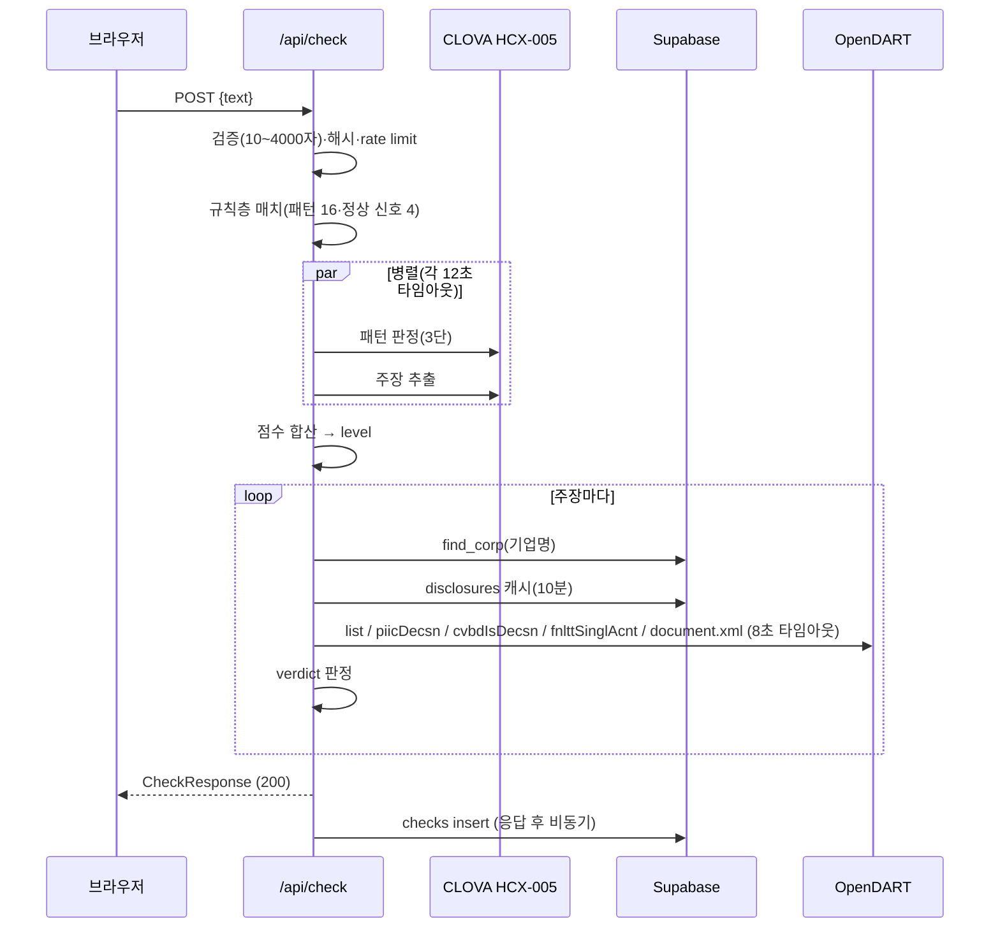

# 사용자 흐름 (기능명세서 §3용)

## 1. 화면 흐름

## 2. 단계별 설명

| 단계 | 사용자 행동 | 시스템 반응 |
|---|---|---|
| 1 접속 | 모바일/PC 브라우저로 URL 접속 | 서비스명 "찌라시체크" + 한 줄 설명, 입력창 표시 |
| 2 입력 | 리딩방·SNS 메시지를 그대로 붙여넣기. 처음이면 예시 카드 클릭 | 글자 수 카운터(최대 4,000자). **예시 카드 클릭 시 textarea를 채우고 자동으로 검사를 실행한 뒤 결과로 스크롤** |
| 3 검사 | "공시로 확인하기" 클릭 | 버튼 안 단계 문구("사기 수법 대조 중…" → "공시 조회 중…", 중복 클릭 방지). 서버 파이프라인 실행(목표 15초 이내) |
| 4 위험 신호 지수 | 점수·등급 확인 | 반원 게이지 + 0~100 점수, 등급 배지(낮음/주의/높음/판단 유보), 근거 문구. 우상단 "결과 복사"로 요약 텍스트 공유. hard 신호면 빨간 배너. 매치 패턴별 인용 구절과 접이식 법적 근거·출처 링크. 진행 단계 바, "다음에 올 가능성이 높은 것", 정상 신호 배지, 정상일 가능성 검토 |
| 5 원문 확인 | 어느 구절이 걸렸는지 확인 | 원문에 매치 구절을 등급 색으로 표시 |
| 6 공시 대조 | 메시지 속 주장(예: "OO 1,000억 수주")이 공시로 확인되는지 확인 | 주장별 행: 판정 배지 + 한 줄 설명(공시 금액·방식·차이율) + DART 원문 링크 + 정정 반영 태그 + 공시 의무 안내 |
| 7 행동 | 안내에 따라 행동 | 등급별 행동 요령, 신고·상담처(전화는 바로 걸기) |
| 8 확인 시각 | 결과가 언제 기준인지 확인 | "최종 확인 YYYY-MM-DD HH:mm KST" + 면책 + "다른 메시지 검사하기"(위로 스크롤·입력 비움) |

## 3. 서버 처리 흐름

## 4. 예외 흐름

| 상황 | 사용자에게 보이는 것 |
|---|---|
| 10자 미만 / 4,000자 초과 | 입력창 아래 안내 문구(400) |
| 분당 10회 초과 | "잠시 요청이 많습니다. 1분 뒤 다시 시도해주세요."(429) |
| LLM 타임아웃·오류·JSON 파싱 실패 | 규칙층 결과로 정상 표시 + 노란 배너 "일부 확인이 지연됐습니다: AI 판정 지연(규칙 기반 결과만 표시)" |
| OpenDART 장애·타임아웃 | 해당 주장 "공시 근거 미확인 — 공시 조회가 일시적으로 불가합니다" + 노란 배너 "DART 공시 조회 지연" |
| 기업명이 상장사 목록에 없음 | "검증 범위 밖 — 상장사에서 'OO'을 찾지 못했습니다" (상장 주장이면 KIND 안내) |
| 네트워크 오류 | "연결이 끊겼습니다. 다시 시도해주세요." |
